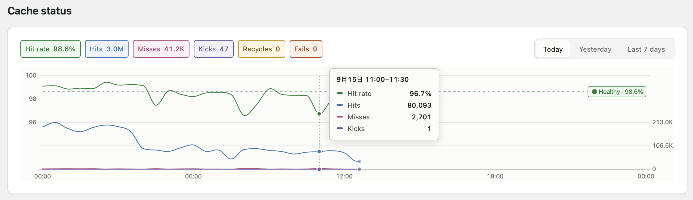
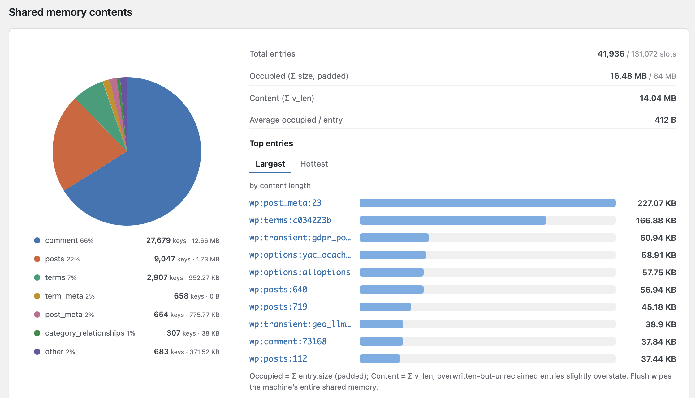

# Yac Object Cache

[](https://github.com/laruence/wordpress-yac-cache/actions/workflows/ci.yml)

A [Yac](https://github.com/laruence/yac) backed object cache for WordPress.

Yac stores the cache in lock-free shared memory inherited by all PHP-FPM
workers on the machine: no cache server, no socket, no network round trips.
A `get()` is one hash lookup in local memory.

Benchmarked against the classic Memcached drop-in on a real WordPress site
(PHP 8.1 FPM, 8 cores): **~19% higher throughput and ~15% lower latency**
across 20/50/100 concurrent users — see [Benchmarks](#benchmarks).

Best fit is single-node (or few-node) WordPress installs.

## Features

- **Self-deploying drop-in** — activation copies `object-cache.php` to
  `wp-content/`; the admin page tracks drop-in version and updates it
- **Readable storage keys** — keys are stored verbatim while they fit Yac's
  48-byte limit (the per-site prefix carried by the instance prefix);
  over-long keys keep
  the group verbatim and hash (crc32b) only the key part, so dumps and the
  dashboard pie chart stay attributable by group. Configurable prefix via
  `YAC_OCACHE_KEY_PREFIX`
- **Pollution guard** — `YAC_OCACHE_SKIP_EMPTY` (on by default, the single
  filter) keeps empty `get_page_by_path:` negatives (bot 404 probes,
  never re-read) request-local
- **False-safe** — a stored `false` is coerced to `0` before writing to
  shared memory (Yac's `get()` cannot tell a stored false from a miss);
  readers comparing by value see `0` instead of `false`
- **Admin dashboard** — live stats, health advice and self-test, see
  [Dashboard](#dashboard)
- **Multisite aware** — keys carry no per-blog prefix; isolation between
  installs sharing one PHP pool lives in `YAC_OCACHE_KEY_PREFIX`; multisite
  blogs share one namespace (run separate installs when they must not)
- **Graceful degradation** — without the Yac extension the drop-in falls back
  to a per-request cache and WordPress keeps working
- **WP-CLI commands** — `wp yac status`, `wp yac flush`

## Dashboard





The first panel is the verdict: hit-rate ring, Healthy / Attention /
Critical, and cause-attributed metric bars — all green when healthy,
only the causing metrics take the verdict color. The second shows what
the shared memory actually holds: keys-by-group pie, occupancy stats and
the largest entries by content length; every key clicks through to the
entry inspector (deserialized value, expiry, last access on newer yac
builds, padded size, delete).

Tools → Yac Object Cache, top to bottom:

- **Status** — one green bar when everything is wired (`Active … round
  trip X ms`), or the concrete problem list otherwise
- **Cache health** — hit-rate ring with a Healthy / Attention / Critical
  verdict, plus per-metric bars (keys, values, hits, misses, kicks,
  recycles); the advice names the `php.ini` knob to raise
- **Shared memory contents** — keys-by-group pie, occupancy stats and
  largest entries, pictured above
- **Configuration** — the wp-config.php knobs with current values
- **Diagnostics** — versions, PHP/Yac runtime facts, key budget
- **Actions** — flush / deploy / update / remove the drop-in

## Requirements

- PHP 7.2+
- WordPress 5.6+
- The Yac extension, installed by any of the three ways below

### Installing Yac

**PECL**

```bash
pecl install yac
```

**PIE** (the PHP Foundation's PECL successor)

```bash
pie install laruence/yac
```

**From source**

```bash
git clone https://github.com/laruence/yac.git
cd yac
phpize
./configure
make
sudo make install
```

Then enable it in `php.ini`:

```ini
extension=yac.so
```

## Installation

### Via WP-CLI

```bash
wp plugin install https://github.com/laruence/wordpress-yac-cache/releases/latest/download/yac-ocache.zip --activate
```

### Via the WordPress admin

Download `yac-ocache.zip` from the [releases page](https://github.com/laruence/wordpress-yac-cache/releases),
then Plugins → Add New → Upload Plugin.

(The plugin has been submitted to the WordPress.org directory and will be
installable from the plugin repository once it passes review.)

### Configuration

In `wp-config.php`, above the "That's all, stop editing!" line:

```php
define( 'WP_CACHE', true );
define( 'YAC_OCACHE_KEY_PREFIX', 'ab_' ); // unique per install when sites share one PHP pool
```

Keys carry no per-blog prefix: with a multisite install all blogs share
one cache namespace. When sites sharing one PHP pool must not see each
other's entries, give each its own `YAC_OCACHE_KEY_PREFIX`.

Check **Tools → Yac Object Cache** for status, stats and flush actions.

## Tuning

```ini
; php.ini
yac.enable = 1
yac.keys_memory_size = 4M      ; ~32K slots
yac.values_memory_size = 64M   ; raise for large sites (alloptions!)
```

> **Do not set `yac.serializer` to `json`.** WordPress's object cache stores
> PHP objects (`WP_Post`, `WP_Term`, option values, …), and a JSON serializer
> cannot round-trip them: objects come back as arrays, and core code feeding
> an array where an object is expected dies with a fatal error (e.g.
> `get_object_vars(): Argument #1 must be of type object, array given`).
> It also corrupts binary data (`json_encode` fails on non-UTF-8 bytes, so
> such values are silently dropped).
>
> Leave the default `php` serializer. If you built Yac with
> `--enable-json` and set `yac.serializer=json`, WordPress breaks the moment
> the first cached object is read back. Note that an unknown serializer name
> in the ini falls back to `php` silently — check `php --ri yac`
> (`Serializer =>`) for what is actually in effect, not what the ini says.

```php
; wp-config.php escape hatches
define( 'YAC_OCACHE_DISABLE', true );    // force runtime-only mode
define( 'YAC_OCACHE_KEY_PREFIX', 'wp' ); // key prefix, 0-6 chars; per-site isolation when sharing a PHP pool

// The single pollution filter: bots probe unbounded one-off URLs and
// each 404 path mints a get_page_by_path:<md5> key whose value is an
// empty negative result — never re-read, yet each occupies a slot.
// With the flag on, those empty values stay request-local. Stable
// per-entity negative caches (comment children, term relationships,
// adjacent posts...) ARE re-read on every view and keep being shared;
// when their working set outgrows the slot table, the remedy is a
// bigger yac.keys_memory_size (the dashboard says so), not skipping.
define( 'YAC_OCACHE_SKIP_EMPTY', true );
```

## Benchmarks

Real-site benchmark on laruence.com (WordPress, PHP 8.1 FPM, 8 cores),
full homepage renders, `ab -t 30 -c <concurrency>`, each run starting from a
flushed cache and restarted php-fpm. Only the drop-in differs between the
two configurations.

| Concurrency | Yac RPS | Memcached RPS | Gain   | Yac p50 | Memcached p50 |
|-------------|---------|---------------|--------|---------|---------------|
| 20          | 141.6   | 118.7         | +19.3% | 139ms   | 167ms         |
| 50          | 140.6   | 118.5         | +18.6% | 353ms   | 420ms         |
| 100         | 142.1   | 118.4         | +20.1% | 699ms   | 840ms         |

Zero failed requests in both configurations. Cross-checked with a fixed
request-count run (`ab -n 10000 -c 100`): 141.8 vs 120.6 RPS (+17.6%).

Note that `wp_cache_flush()` calls `Yac::flush()` and wipes the **entire**
shared memory on the machine, including data written by other Yac users
sharing the same PHP pool. The admin page asks for confirmation. Decide
before you flush.

## Tests

```bash
php -d yac.enable_cli=1 tests/smoke.php   # shared-memory path
php -n tests/smoke.php                    # runtime-only fallback path
php tests/shell.php                       # plugin shell (deploy/status)
php tests/render.php                      # admin page render (charts/advice)
```

## License

GPLv2 or later.
