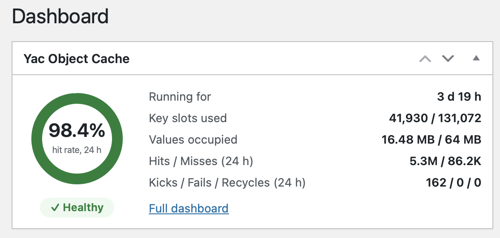

# Yac Object Cache For Wordpress

[](https://github.com/laruence/wp-yac-cache/actions/workflows/ci.yml)
[](https://github.com/laruence/wp-yac-cache/actions/workflows/live-wp.yml)

A [Yac](https://github.com/laruence/yac) backed object cache for WordPress.

Yac stores the cache in lock-free shared memory accessible to all PHP
workers: no cache server, no socket, no network round trips. A `get()` is
one hash lookup in local memory.

On the author's own site ([www.laruence.com](https://www.laruence.com),
PHP 8.1 FPM, 8 cores) it came out **~19% higher throughput and ~15% lower
latency** than the classic Memcached drop-in across 20/50/100 concurrent
users — see [Benchmarks](#benchmarks).

Best fit is single-node (or few-node) WordPress installs.

## Features

- **Fast** — a `get()` is a hash lookup in memory the worker already has
  mapped: no socket, no network, no global lock (per-slot CAS, so throughput
  scales with worker count). On the author's own site the admin page
  measures the round trip at 0.005 ms and full page renders came out ~19%
  faster than the Memcached drop-in, see [Benchmarks](#benchmarks)
- **Nothing to operate** — no cache server to install, configure, secure,
  monitor or restart. The cache is shared memory the PHP workers attach
  to, so the only moving part is PHP itself
- **Health you can read** — hit rate, hits and misses charted over
  Today / Yesterday / Last 7 days, and a diagnosis that also says when *not*
  to add memory. Every key clicks through to its stored value, see
  [Screens](#screens)
- **Fails soft** — no Yac extension, or `yac.enable=0`, and the drop-in falls
  back to a per-request cache; the site keeps serving instead of dying on a
  missing backend

Storage behaviour worth knowing: keys are stored verbatim while they fit
Yac's 48-byte limit (over-long ones keep the group and hash only the key
part, so dumps stay attributable by group); empty negative results expire
after `YAC_OCACHE_EMPTY_TTL` instead of occupying a slot forever; and a
stored `false` is written as `0`, because Yac's `get()` cannot tell a stored
false from a miss — readers comparing by value see `0`.

**Multisite is a caveat, not a feature.** Keys carry no per-blog prefix, so
blogs of one install share a namespace and `switch_to_blog()` does not
re-namespace. Give each install its own `YAC_OCACHE_KEY_PREFIX` when sites
sharing a PHP pool must not see each other's entries.

## Screens

The Dashboard widget summarises the cache without opening anything:



Tools → Yac Object Cache has the detail:


Hit rate, hits and misses over Today / Yesterday / Last 7 days, with the
window's kicks, recycles and failures. Counters are sampled every 15
minutes into a ~7-day ring; hovering the verdict gives the capacity
diagnosis — including when *not* to add memory.


What the shared memory actually holds: keys-by-group pie, occupancy totals
and the largest (or hottest) entries. Every key clicks through to the entry
inspector — deserialized value, padded size, expiry, delete, plus hits and
embedded-in-slot on newer yac builds.

Below those: **Configuration** (wp-config knobs with current values),
**Diagnostics** (versions, PHP/Yac runtime facts) and **Actions** (flush /
deploy / update / remove the drop-in).

## Requirements

- PHP 7.2+
- WordPress 5.6+
- The Yac extension, installed by any of the three ways below

### Installing Yac

**PECL**

```bash
pecl install yac
```

**PIE** (the PHP Foundation's PECL successor)

```bash
pie install laruence/yac
```

**From source**

Download the latest [release](https://github.com/laruence/yac/releases), unzip it, then inside:

```bash
phpize && ./configure && make && make install
```

Then enable it in `php.ini`:

```ini
extension=yac.so
```

## Installation

### From the WordPress plugin directory (recommended)

Plugins → Add New → search for "Yac Object Cache", or via WP-CLI:

```bash
wp plugin install yac-object-cache --activate
```

Directory page: [Yac Object Cache in the WordPress plugin directory](https://wordpress.org/plugins/yac-object-cache/)

### From GitHub releases

Via WP-CLI:

```bash
wp plugin install https://github.com/laruence/wp-yac-cache/releases/latest/download/yac-obj-cache.zip --activate
```

Or download `yac-obj-cache.zip` from the [releases page](https://github.com/laruence/wp-yac-cache/releases),
then Plugins → Add New → Upload Plugin.

### Configuration

None required. Activation deploys the drop-in and WordPress loads
`wp-content/object-cache.php` on its own. Optional switches, in
`wp-config.php` above the "That's all, stop editing!" line:

```php
define( 'YAC_OCACHE_KEY_PREFIX', 'ab' ); // default wp, 0-6 chars; the only isolation between installs sharing a PHP pool
define( 'YAC_OCACHE_EMPTY_TTL', 21600 ); // default 6h; lifetime cap on empty negative results, 0 disables
define( 'YAC_OCACHE_DISABLE', true );    // escape hatch: force runtime-only mode
```

Check **Tools → Yac Object Cache** for status, stats and flush actions.

## Tuning

```ini
; php.ini
yac.enable = 1
yac.keys_memory_size = 16M     ; ~128K slots (~32K per 4M)
yac.values_memory_size = 64M   ; raise for large sites (alloptions!)
```

> **Do not set `yac.serializer` to `json`.** WordPress's object cache stores
> PHP objects (`WP_Post`, `WP_Term`, option values, …), and a JSON serializer
> cannot round-trip them: objects come back as arrays, and core code feeding
> an array where an object is expected dies with a fatal error (e.g.
> `get_object_vars(): Argument #1 must be of type object, array given`).
> It also corrupts binary data (`json_encode` fails on non-UTF-8 bytes, so
> such values are silently dropped).
>
> Leave the default `php` serializer. If you built Yac with
> `--enable-json` and set `yac.serializer=json`, WordPress breaks the moment
> the first cached object is read back. Note that an unknown serializer name
> in the ini falls back to `php` silently — check `php --ri yac`
> (`Serializer =>`) for what is actually in effect, not what the ini says.

Why `YAC_OCACHE_EMPTY_TTL` exists: bots probe unbounded one-off URLs and
WordPress mints a cache entry per query (`get_page_by_path:<md5>`, comment
query hashes), often holding an empty negative result. Written without
expiry, each one occupies a slot forever. The TTL keeps them shared —
re-reads still hit — but lets them age out.

## Benchmarks

Real-site benchmark on laruence.com (WordPress, PHP 8.1 FPM, 8 cores),
full homepage renders, `ab -t 30 -c <concurrency>`, each run starting from a
flushed cache and restarted php-fpm. Only the drop-in differs between the
two configurations.

| Concurrency | Yac RPS | Memcached RPS | Gain   | Yac p50 | Memcached p50 |
|-------------|---------|---------------|--------|---------|---------------|
| 20          | 141.6   | 118.7         | +19.3% | 139ms   | 167ms         |
| 50          | 140.6   | 118.5         | +18.6% | 353ms   | 420ms         |
| 100         | 142.1   | 118.4         | +20.1% | 699ms   | 840ms         |

Zero failed requests in both configurations. Cross-checked with a fixed
request-count run (`ab -n 10000 -c 100`): 141.8 vs 120.6 RPS (+17.6%).

Note that `wp_cache_flush()` calls `Yac::flush()` and wipes the **entire**
shared memory on the machine, including data written by other Yac users
sharing the same PHP pool. The admin page asks for confirmation. Decide
before you flush.

## Tests

```bash
php -d yac.enable_cli=1 tests/smoke.php   # shared-memory path
php -n tests/smoke.php                    # runtime-only fallback path
php tests/shell.php                       # plugin shell (deploy/status)
php tests/render.php                      # admin page render (charts/advice)
```

## License

GPLv2 or later.
