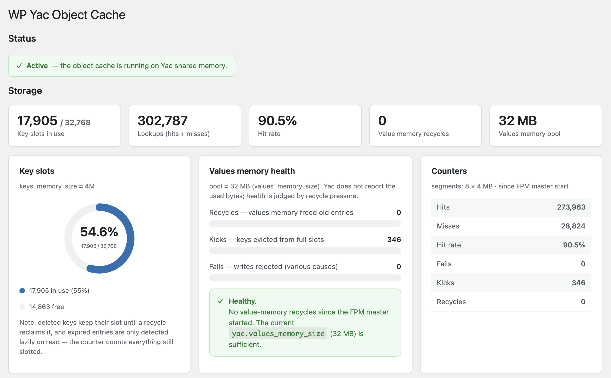

# 用 Yac 给 WordPress 做对象缓存:实测比 Memcached 快 19%

> 作者:Laruence(鸟哥)
> 日期:2026-08
> 状态:草稿

## 背景

这个博客(laruence.com)跑了十几年,对象缓存一直用的是 Memcached。稳定、经典,没出过什么问题,但每次读缓存都要走一次 localhost TCP:连接管理、协议编解码、网络往返,单条几十微秒,一个 WordPress 请求要读几十上百次,加起来就是毫秒级的固定开销——而且这部分开销和命中率无关,命中了也逃不掉。

Yac(Yet Another Cache)是我 2013 年写的一个 PHP 扩展,思路很直接:把缓存放进 FPM master 进程创建的共享内存里,所有 worker fork 时直接继承。没有缓存服务器,没有 socket,没有网络——`get()` 就是本进程地址空间里的一次 hash 查找。这么多年下来,大量生产环境验证了它的稳定。这次我想试试:拿它替换 WordPress 的 Memcached,到底能省多少?

于是有了 [WP Yac Object Cache](https://github.com/laruence/wordpress-yac-cache):一个自带 `object-cache.php` drop-in 的 WordPress 插件,激活即部署,后台带完整的状态面板。



后台面板:Active 状态条、键槽水位环形图、命中率、内存健康建议和计数器,一屏看完缓存的全部状态。

## 压测:Yac vs Memcached

### 环境

- 站点:laruence.com,真实 WordPress 站点,首页完整渲染(非静态页、非 API 桩)
- 服务器:8 核 / 31G,PHP 8.1 FPM,Nginx
- Memcached:memcached 服务(localhost:11211)+ 官方 `memcached` 扩展 drop-in
- Yac:WP Yac v1.0.0,`yac.keys_memory_size=4M`,`yac.values_memory_size=64M`
- 工具:`ab`,压测期间临时关闭 nginx 限速

### 方法

两个方案严格对称地跑,只换 drop-in,其他一切不动:

1. `wp cache flush` 清空缓存
2. 重启 php-fpm(Yac 组同时获得全新共享内存,起点一致)
3. 500 请求预热
4. `ab -t 30 -c <并发>`,并发取 20 / 50 / 100 三档

### 结果

| 并发 | Yac RPS | Memcached RPS | 提升 | Yac p50 | Mem p50 | Yac p95 | Mem p95 |
|------|---------|---------------|------|---------|---------|---------|---------|
| 20   | 141.6   | 118.7         | +19.3% | 139ms | 167ms | 192ms | 216ms |
| 50   | 140.6   | 118.5         | +18.6% | 353ms | 420ms | 407ms | 465ms |
| 100  | 142.1   | 118.4         | +20.1% | 699ms | 840ms | 754ms | 886ms |

每档 30 秒,3500~4200 个完整页面渲染,全部 200,0 失败。

### 几个观察

**1. 优势恒定在 ~19%,不随并发变化。** 两组的吞吐都在 20 并发时就饱和了(Yac 从 141.6 到 100 并发的 142.1,几乎一条直线),天花板是 PHP 渲染 + MySQL,不是缓存。Yac 的领先来自每个请求里省掉的几十次 localhost TCP 往返——这是固定开销,所以提升比例稳定。

**2. 吞吐饱和后,延迟随并发线性增长。** c100 的 p50(699ms)约是 c20(139ms)的 5 倍——排队论的标准形态:服务速率不变,队列变长。单机的真实容量就在这个量级,再要提升得动 OPcache、页面缓存或多机部署,而不是继续优化对象缓存。

**3. 交叉验证。** 换 `ab -n 10000 -c 100` 的固定请求数测法,结论一致(Yac 141.8 vs Memcached 120.6,+17.6%)。

省掉的到底是什么?一个 WordPress 首页请求要做几十到上百次 `wp_cache_get`(options、terms、post meta……)。Memcached 每次命中也是一次 localhost TCP 往返;Yac 是进程内共享内存的一次 hash 查找。差距不在"命中与否",而在"命中之后花多少代价拿到值"。

## 安装

先装 Yac 扩展,三种方式任选:

```bash
# PECL
pecl install yac

# PIE(PHP Foundation 的 PECL 继任者,yac 已在 Packagist)
pie install laruence/yac

# 源码编译
git clone https://github.com/laruence/yac.git && cd yac
phpize && ./configure && make && sudo make install
```

然后 `php.ini` 里启用 `extension=yac.so`。

### 方式一:WP-CLI(推荐)

```bash
wp plugin install https://github.com/laruence/wordpress-yac-cache/releases/latest/download/wp-yac-cache.zip --activate
```

### 方式二:GitHub Release

到 [Releases 页面](https://github.com/laruence/wordpress-yac-cache/releases)下载 `wp-yac-cache.zip`,WordPress 后台 → 插件 → 安装插件 → 上传,激活即可。

### 配置

激活后 drop-in 自动部署到 `wp-content/object-cache.php`。在 `wp-config.php` 的 "That's all, stop editing!" 之前加两行:

```php
define( 'WP_CACHE', true );
define( 'WP_YAC_KEY_PREFIX', 'ab_' ); // 共享 PHP 池时,每个站点用不同前缀(键不再带 blog 前缀,多站点博客共享命名空间)
```

可选调优(php.ini):

```ini
yac.enable = 1
yac.keys_memory_size = 4M      ; 约 32K 槽位
yac.values_memory_size = 64M   ; alloptions 大的站点调大
```

插件已提交 WordPress.org 插件目录审核,通过后可以直接在 WordPress 后台搜索安装——不过考虑到审核速度,等着吧。

## 使用说明

- **单机最适合**:Yac 是本机共享内存缓存,单机(或少量互不同步的节点)场景收益最大;多机集群需要共享一致缓存时,Memcached/Redis 的网络共享反而是特性
- **flush 的语义**:`wp_cache_flush()` 会清空这台机器上的整块 Yac 共享内存,包括同一 PHP 池里其他 Yac 用户的数据。后台按钮有确认弹窗,想清楚再按
- **降级**:没装 Yac 扩展时 drop-in 退化为请求内缓存,站点照常工作
- **后台面板**:Tools → Yac Object Cache,有内存水位、命中率、容量建议和自检

## 结语

对象缓存其实不是这个站点的瓶颈——压测数据说得很清楚,142 RPS 的天花板在 PHP 渲染和 MySQL。但同样的天花板之下,Yac 把每个请求的固定开销削掉了一截:同条件快 ~19%,延迟低 ~15%,而且少维护一个 Memcached 服务。对单机 WordPress,这笔账很划算。

项目地址:[github.com/laruence/wordpress-yac-cache](https://github.com/laruence/wordpress-yac-cache)(GPLv2)
